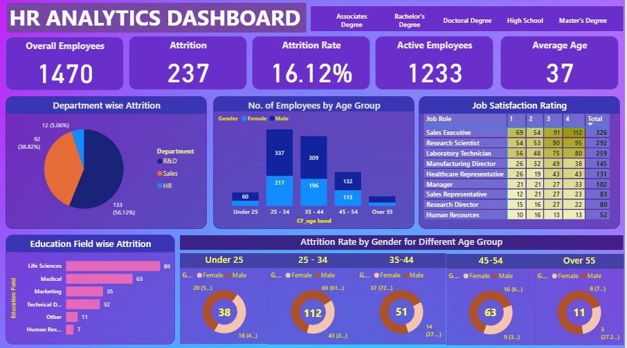

# HR Analytics Dashboard

## Objective

Developed an interactive HR Analytics Dashboard to identify key factors influencing employee attrition and provide data-driven insights for improving workforce retention and HR decision-making.

## Project Highlights

Throughout this project, I:

- Dived deep into HR data to uncover valuable insights.
- Developed interactive dashboards to visualize key HR metrics.
- Provided data-driven recommendations for strategic decision-making.

## Steps Followed

### 1. Data Gathering
- Imported raw CSV data into Power BI.
- Used Power Query Editor for data transformation and preprocessing.

### 2. Data Cleaning
- Removed duplicate records.
- Handled missing values and errors.
- Renamed columns and standardized values.
- Corrected data types using Power Query.

### 3. Data Processing
- Created an **AttritionCount** column using conditional logic:
  - If Attrition = "Yes" → 1
  - Else → 0
- Created DAX measures for:
  - Attrition Rate
  - Active Employees

### 4. Data Analysis
- Built KPI Cards
- Pie Charts
- Donut Charts
- Bar Charts
- Matrix Tables
- Slicers and Filters

## Dashboard Questions

- What is the total employee count?
- What is the average age and salary?
- What is the attrition count by gender?
- Which department has the highest attrition?
- What is the gender distribution?
- Which education field has the most employees?
- Which business travel category has the most employees?

## Dashboard Preview

## Key Insights

- Total Employees: **1470**
- Attrition Count: **237**
- Attrition Rate: **16.12%**
- Active Employees: **1233**
- Average Age: **37 Years**
- Research & Development department had the highest attrition.
- Life Sciences education field showed the highest employee attrition.
- Employees aged **25–34** experienced the highest turnover.
- Sales roles were the most affected by attrition.

## Technologies Used

- Power BI
- Power Query
- DAX
- Excel
- CSV Dataset
